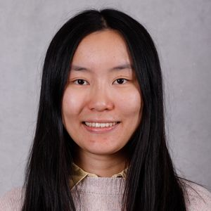

## About Me

Hi! I'm Oli, a second year PhD student in the [CDT for Natural language processing](https://web.inf.ed.ac.uk/cdt/natural-language-processing) at the University of Edinburgh. I work with [Sharon Goldwater](https://homepages.inf.ed.ac.uk/sgwater/) on computational modeling for phonetic acquisition and speech perception.

Before coming to Edinburgh, I did an MEng & BA in information engineering and then an MPhil in computer science at the University of Cambridge, where I was a member of Emmanuel and Christ's College. I also spent one year at the University of Hong Kong as the fourth cohort of the HKU-Cambridge joint recruitment scheme before coming to the UK.

I come from [Guizhou](https://en.wikipedia.org/wiki/Guizhou), China.
