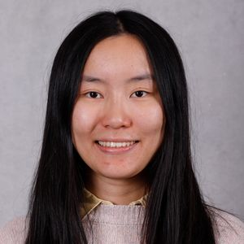

## About me

Hi! I'm a PhD student in the [CDT in Natural language processing](https://web.inf.ed.ac.uk/cdt/natural-language-processing) at the University of Edinburgh, where I work with [Sharon Goldwater](https://homepages.inf.ed.ac.uk/sgwater/) and [Hao Tang](https://homepages.inf.ed.ac.uk/htang2/), and collaborate with [Naomi Feldman](https://users.umiacs.umd.edu/~nhf/index.html). 

In my research, I study *how* self-supervised models of speech encode information about [speakers](https://arxiv.org/pdf/2305.12464.pdf) or about [context (neighboring phones)](https://arxiv.org/pdf/2405.08237). Specifically, I am interested in the representational geometry of different types of variability. More generally, I am interested in how humans and machines acquire and process language. 

### News

June 2025 - I will be attending 

September 2024 - This past summer, I attended HILS in Nijmegen ([poster](hils_poster.pdf)), Cogsci in Rotterdam ([talk](Cogsci_talk.pdf)), and Interspeech in Kos ([poster](interspeech_poster.pdf)). 

June 2024 - I gave a [talk](UPF-BSC_talk.pdf) at the University of Pompeu Fabra and Barcelona Supercomputing centre on June 26 and 28. 

May 2024 - Our CogSci 2024 paper won the Computational Modeling Prize in Perception & Action!

