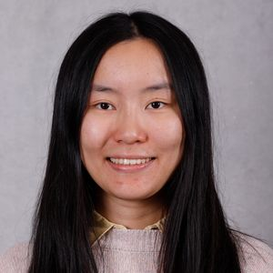

## About me

Hi! I'm Oli. 

I'm an incoming postdoc researcher in the [LaCNS research group](https://lacns.github.io/) at the Max Planck Institute for Psycholinguistics, working with [Andrea E. Martin](https://sites.google.com/site/aemn1011/home). 
I use computational models to understand how humans acquire and process speech and language. Specifically, my PhD research has focused on the challenges posed by the transiency and variability of speech.

I did my PhD in the [CDT in Natural language processing](https://web.inf.ed.ac.uk/cdt/natural-language-processing) at the University of Edinburgh, where I work with [Sharon Goldwater](https://homepages.inf.ed.ac.uk/sgwater/), [Hao Tang](https://homepages.inf.ed.ac.uk/htang2/), and [Naomi Feldman](https://users.umiacs.umd.edu/~nhf/index.html). 
Before Edinburgh, I did my undergraduate in information engineering and master's in computer science at University of Cambridge. 

I like books and music and cats, but then who does not? My favorite authors are Elif Batuman and Eileen Chang. 

