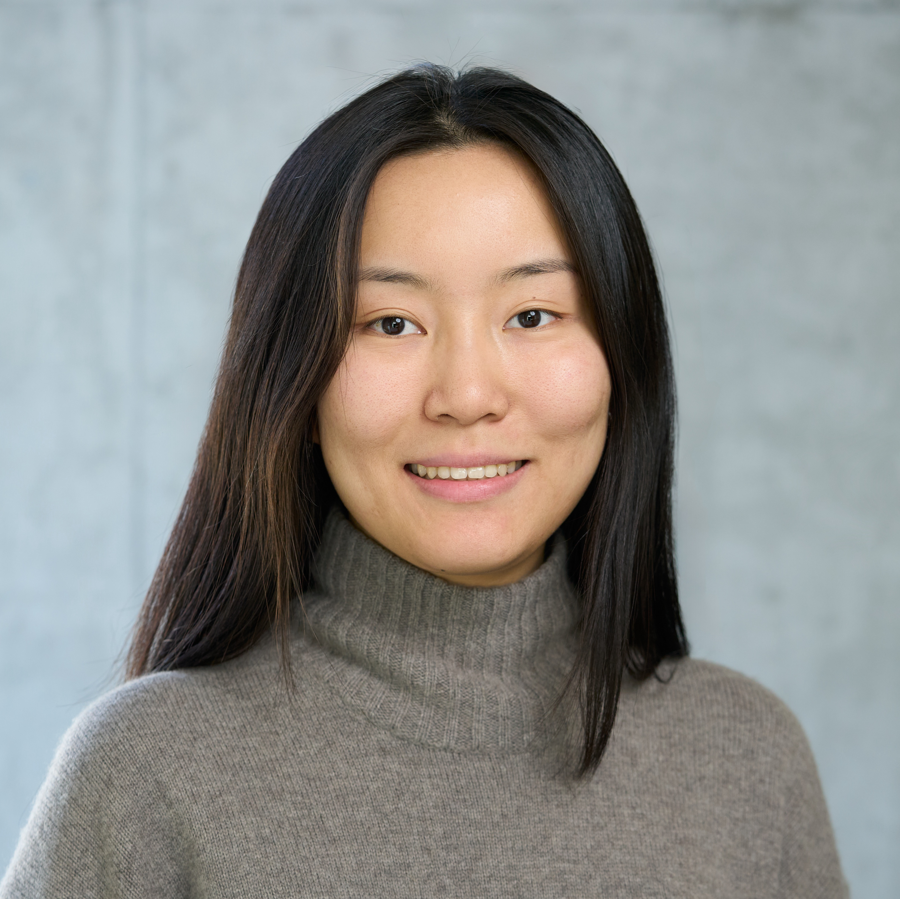

## About Me

Hi! I'm Oli, a third year PhD student in the [CDT in Natural language processing](https://web.inf.ed.ac.uk/cdt/natural-language-processing) at the University of Edinburgh. I work with [Sharon Goldwater](https://homepages.inf.ed.ac.uk/sgwater/) and [Hao Tang](https://homepages.inf.ed.ac.uk/htang2/) on computational modeling for phonetic acquisition and speech perception. Currently, I'm exploring how self-supervised speech representations encode information about the [speaker](https://arxiv.org/pdf/2305.12464.pdf) or about neighbouring phones.    
Email me (oli.liu) here: ed.ac.uk to talk about my research or Edinburgh or speech or NLP or cognitive science :) 
